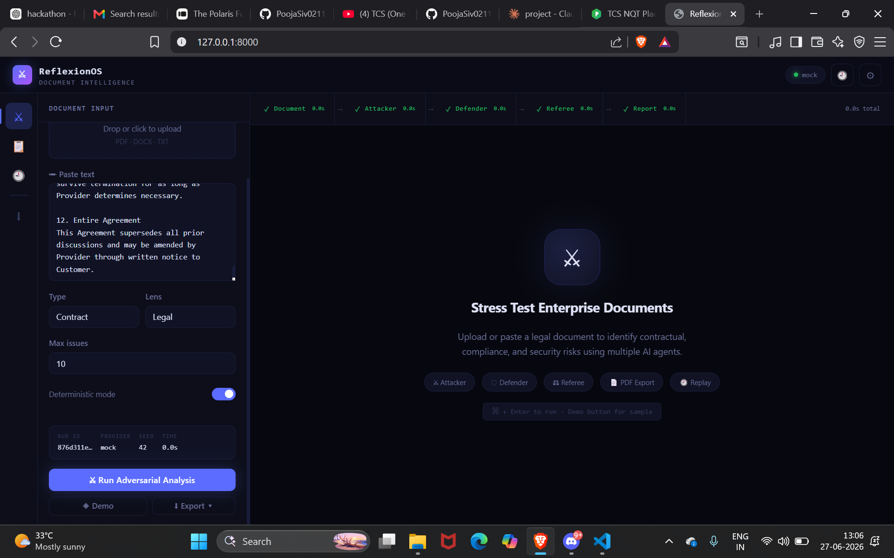
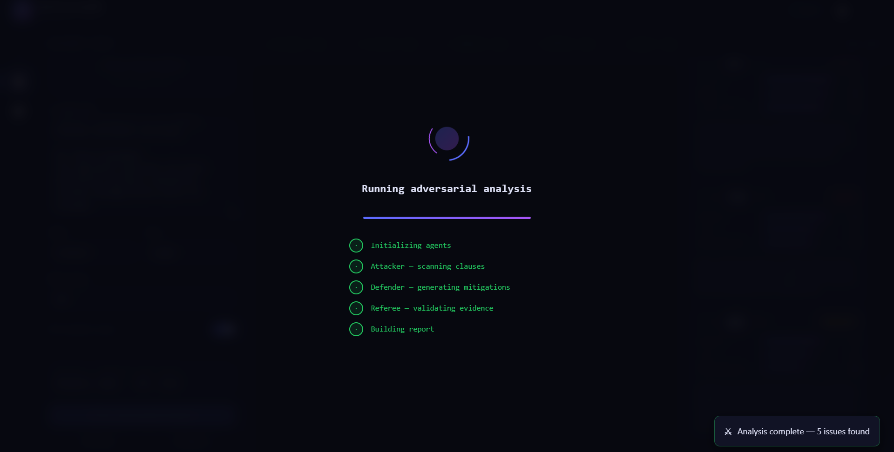
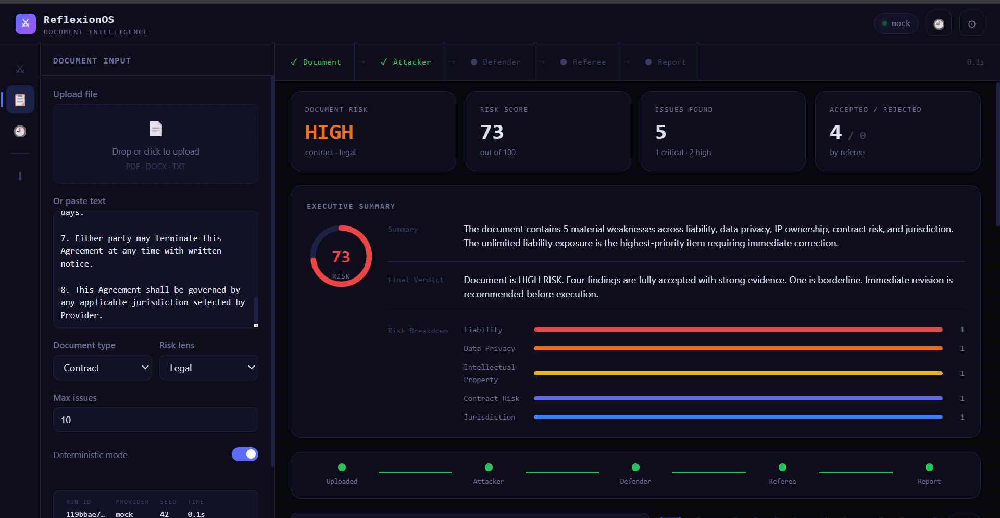
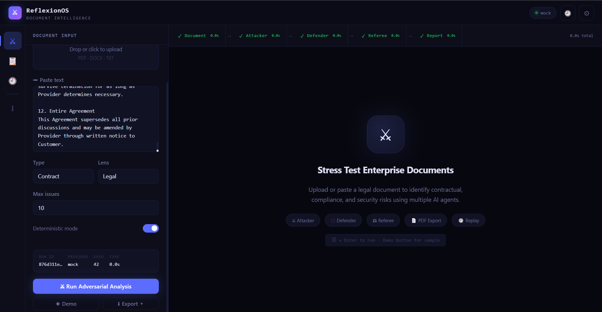
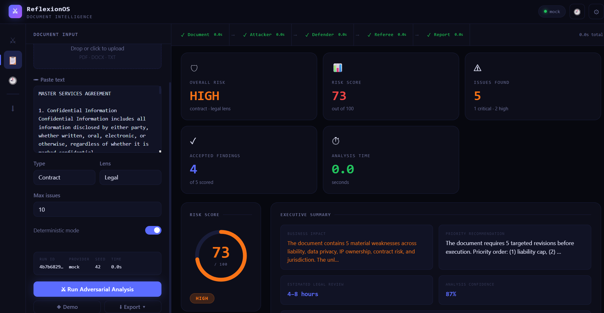
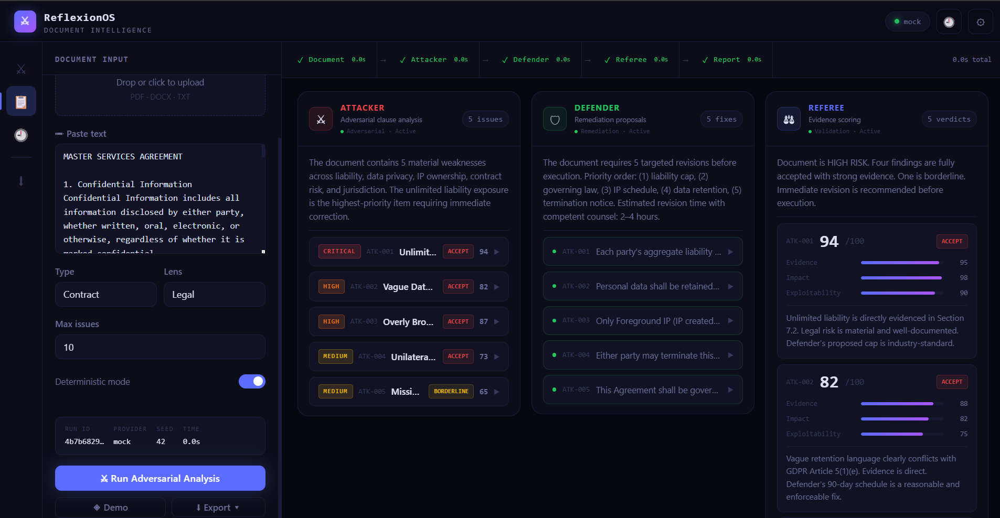
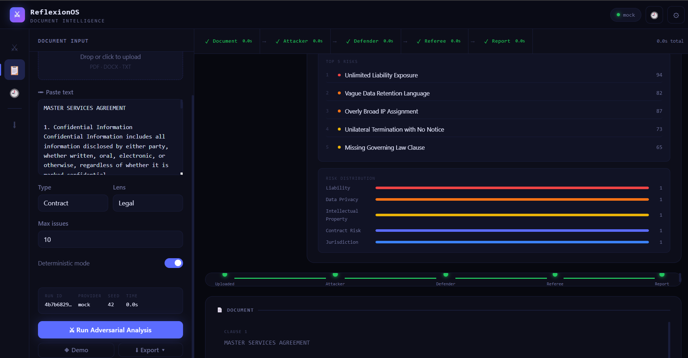
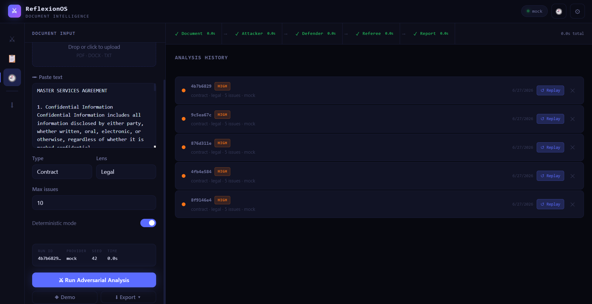

# ReflexionOS

**Adversarial Document Intelligence Platform**

> A penetration test for legal documents.

Three AI agents — Attacker, Defender, and Referee — collaboratively evaluate enterprise documents to surface weaknesses before they become legal or security problems.

---

## Quick Start

### 1. Install dependencies
```bash
cd reflexionos
pip install -r requirements.txt
```

### 2. Run with Mock Provider (no AWS needed)
```bash
cd backend
uvicorn app:app --reload --port 8000
```
Open http://localhost:8000

### 3. Run with Amazon Nova 2 Lite (AWS Bedrock)
```bash
# Configure AWS credentials
export AWS_ACCESS_KEY_ID=your_key
export AWS_SECRET_ACCESS_KEY=your_secret
export AWS_DEFAULT_REGION=us-east-1

# Switch to Bedrock provider
export REFLEXION_PROVIDER=bedrock

cd backend
uvicorn app:app --reload --port 8000
```

---
# ReflexionOS

**Adversarial Document Intelligence Platform**

> A penetration test for legal and enterprise documents.

ReflexionOS is an AI-powered document intelligence platform that stress-tests contracts, NDAs, policies, and enterprise agreements using a three-agent reasoning workflow: **Attacker → Defender → Referee**.

Instead of simply summarizing a document, ReflexionOS finds risky clauses, proposes safer alternatives, validates evidence, scores risk, and generates export-ready reports.

---

## Screenshots

### Landing Page


### Running Analysis


### Executive Dashboard


### Document Viewer


### Agent Analysis


### Referee Scorecards



### Export Report


### History



---

## Key Features

- Multi-agent document review system
- Attacker agent for adversarial risk discovery
- Defender agent for mitigation and safer clause suggestions
- Referee agent for evidence scoring and verdicts
- Executive dashboard with risk score and summary
- Clause-level document viewer
- Risk distribution analytics
- Search and filter for findings
- Replayable analysis history
- PDF, JSON, and CSV export
- Mock provider for offline demos
- Optional AWS Bedrock provider support

---


## Architecture

```
reflexionos/
├── backend/
│   ├── app.py              # FastAPI application
│   ├── engine.py           # Three-agent reasoning orchestrator
│   ├── models.py           # Pydantic schemas
│   ├── store.py            # JSONL trace storage
│   ├── report.py           # PDF export
│   └── providers/
│       ├── base.py         # Provider interface
│       ├── mock_provider.py
│       └── bedrock_provider.py
├── frontend/
│   └── index.html          # Single-file enterprise UI
└── requirements.txt
```

---

## API Endpoints

| Method | Path | Description |
|--------|------|-------------|
| GET | `/` | Serve frontend |
| GET | `/api/health` | Provider status |
| POST | `/api/run` | Execute adversarial analysis |
| GET | `/api/replay/{run_id}` | Replay previous run |
| GET | `/api/runs` | List all runs |
| GET | `/api/report/{run_id}` | Download PDF report |

### POST /api/run

```json
{
  "document": "...",
  "document_type": "contract",
  "risk_lens": "legal",
  "deterministic": true,
  "max_issues": 10
}
```

---

## Providers

Set `REFLEXION_PROVIDER` environment variable:

- `mock` — No AWS required. Returns deterministic demo output.
- `bedrock` — Amazon Nova 2 Lite via AWS Bedrock Runtime.

The Bedrock provider uses the `us.amazon.nova-lite-v1:0` inference profile with `temperature=0` for deterministic mode.

---

## Agent Pipeline

```
Document
  ↓
[Attacker]  → Issues with severity, evidence, recommendations
  ↓
[Defender]  → Improved wording, suggested clauses, compliance notes
  ↓
[Referee]   → Evidence strength, impact, exploitability, verdict (0–100)
  ↓
Trace saved to JSONL → Replayable at any time
  ↓
PDF report available for download
```

---

## Deterministic Mode

When enabled:
- `temperature = 0`
- `seed = 42`
- Identical inputs produce identical outputs

Disable for more creative/varied analysis.

---

Built for the **Amazon Nova AI Hackathon**.
